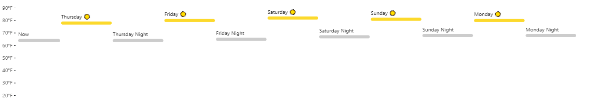

```{r setup, include=FALSE}
knitr::opts_chunk$set(echo = TRUE)
```

## Git, GitHub

1. *What is your GitHub username?*
brockbriggs

2. *What is the URL of your remote GitHub repo (created through Mr. Kennedy's exercises)?*
https://github.com/odu-cs625-datavis/fall22-hw1-brockbriggs

## R

The command below will load the tidyverse package.  If you have installed R, RStudio, and the tidyverse package, it should display a list of loaded packages and their versions.
```{r}
library(tidyverse)
```
Verified tidyverse upload.
Packages: ggplot2, tibble, tidyr, readr, purrr, dplyr, stringr, forcats

## R Markdown 

1. *Create a bulleted list with at least 3 items*

2. *Write a single paragraph that demonstrates the use of italics, bold, bold italics, code, and includes a link. The paragraph does not have to make sense.*

3. *Create a level 3 heading*

## R 

#### Data Visualization Exercises

1. (Q2) *How many rows are in mpg? How many columns?*

1. (Q4) *Make a scatterplot of hwy vs cyl.*


#### Workflow: basics Exercises

1. (Q2) *Tweak each of the following R commands so that they run correctly (`library(tidyverse)` is correct):*

```r
library(tidyverse)
ggplot(dota = mpg) + 
  geom_point(mapping = aes(x = displ, y = hwy))

fliter(mpg, cyl = 8)

filter(diamond, carat > 3)
```

## Google Colab

1. *What are the URLs of your Google Colab notebooks (both Python and R)?*
https://colab.research.google.com/drive/14q6jmbHJz9RG1P5X57s4pfGtb0mf_OXH?usp=sharing
https://colab.research.google.com/drive/1xPbho6fDlb7fhN8w117u4p4mhhIF7hEW?usp=sharing

## Tableau

*Insert your the image of your final bar chart here*

1. *What conclusions can you draw from the chart?*

## Observable and Vega-Lite

### A Taste of Observable

1. *In the "New York City weather forecast" section, try replacing `Forecast: detailedForecast` with `Forecast: shortForecast`. Then press the blue play button  or use Shift-Return to run your change. What happens?*

The forecast description changes from including weather, temperatures, and wind to only 1-2 words on weather.

2. *Under the scatterplot of temperature vs. name, try replacing `markCircle()` with `markSquare()`. Then press the blue play button  or use Shift-Return to run your change. What happens? How about `markPoint()`?*

The icons in the scatterplot change from circles to squares when replacing 'markCircle()' with 'markSquare()'. 'markPoint()' change alters the icons to empty outlined circles.

3. *Under "Pick a location, see the weather forecast", pick a location on the map.  Where was the point you picked near?*

Mountain Home, ID

4. *The last visualization on this page is a "fancy" weather chart embedded from another notebook.  Click on the 3 dots next to that chart and choose 'Download PNG'.  Insert the PNG into your report.*



### Charting with Vega-Lite

`markCircle()`

1. *Pass an option of `{ size: 200 }` to `markCircle()`.*
1. *Try `markSquare` instead of `markCircle`.*
1. *Try `markPoint({ shape: 'diamond' })`.*

`vl.x().fieldQ("Horsepower")`, ...

1. *Change `Horsepower` to `Acceleration`*
1. *Swap what fields are displayed on the x- and y-axis*

`vl.tooltip().fieldN("Name")`

1. *Change `Name` to `Origin`.*

Another example, `count()`

1. *Remove the `vl.y().fieldN("Origin")` line.*
1. *Replace `count()` with `average("Miles_per_Gallon")`.*

## References

*Every report must list the references that you consulted while completing the assignment. If you consulted a webpage, you must include the URL.*

* Insert Reference 1, https://www.example.com
* Insert Reference 2, https://www.example.com/reallyreallyreally-extra-long-URI/
